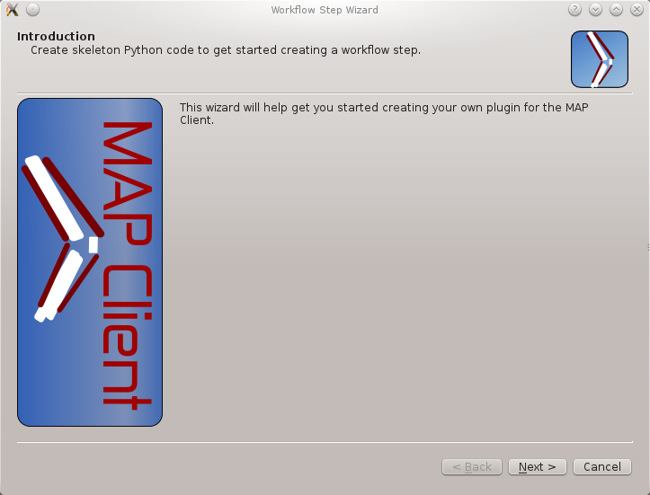
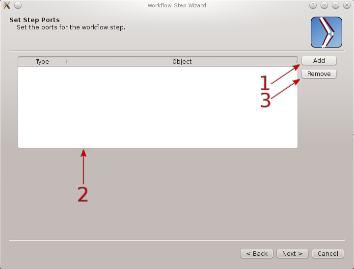
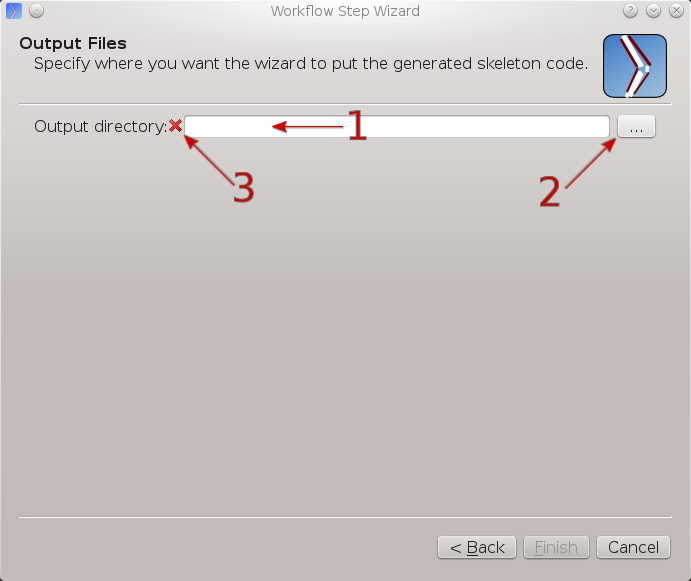

.. _MAP-plugin-wizard:

=========================
MAP Plugin Creator Wizard
=========================

.. sectionauthor:: Hugh Sorby

.. _launchpad project: http://launchpad.net/mapclient
.. _MAP: https://simtk.org/home/map

.. note::
   `MAP`_ is currently under active development, and this document will be updated to reflect any changes to the software or new features that are added. You can follow the development of MAP at the `launchpad project`_.

The plugin lies at the heart of the MAP framework and the Plugin Creator Wizard creates skeleton plugins conforming to the MAP framework plugin interface.  The Plugin Creator Wizard assists with the initial plugin creation allowing the plugin developer to concentrate on implementing the plugins task.  For basic familiararity with the MAP Client please read the feature demonstration document :doc:`MAP-feature-demonstration`.

For more detailed information on the plugin interface read the :doc:`MAP-plugin` document, this document defines the plugin interface that the new plugin must adhere to.

The Plugin Creator Wizard takes the user through a series of pages/dialogs that user fills out as suits their needs.  The pages and a description about the elements in each page is given below.  To move from one page to the next use the 'next' button at the bottom of the page, for some pages the 'next' button is only available once the page is complete.  If the 'next' button is not available for a page it will be because at least one of the pages required fields is incomplete.  Required fields that are incomplete will be marked with a small cross icon (|cross icon|).  Once all the required fields are complete the 'next' button will become available, or the 'finish' button in the case of the last page/dialog.

.. |cross icon| image:: resources/images/cross.png
   :width: 10px
   :height: 10px

Introduction Page
=================

The introduction page contains a short welcome message and a paragraph on the Plugin Creator Wizards purpose.

   
   **Figure:** The introduction page.

Identification Page
===================

The identification page sets the name for the Workflow step, the Python package name and optionally the step icon.  The Workflow step name can be set in the text box (1).  As a recommendation Workflow step names should be defined in camel case.  The Workflow step name is visible in the Step box when active in the application so a descriptive name will aide users.  Examples of step names are: 'Image Source', 'Point Cloud Serializer' and 'Segmentation'.  The wizard will derive the package name from the step name automatically, it will also make changes so that the package name conforms to the PEP8 guidelines for Python.  The wizard will also append the text 'step' to the package name.  However if the default name is unsatisfactory the package name can be edited directly (2) and given an alternative name.  The matching package names for the examples given above would be: 'imagesourcestep', 'pointcloudserializerstep' and 'segementationstep'.  An icon may also be specified using the icon text box (3), the file may also be chosen from the file system using the file chooser button (4).  When an icon is specified it will be copied into the created skeleton step and be made available as a qt resource.

.. figure:: resources/images/plugin_wizard_identify_1.png
   :align: center
   :width: 75%
   
   **Figure:** The identification page.

The step icon is an important part of the Workflow step as it is used to identify it graphically on the Workflow canvas.  The default icon displays the step name across the icon to help differentiate it from other steps with no icon specified.  A preview of the step icon (5) is shown so that you can see how it will look in the application.

Ports Page
==========

The ports page sets up the ports for the step.  To add a port use the 'Add' button (1).  This will create an entry in the port list (2) with a default type of 'provides' and an empty object.  A port can either provide or use a given object.  The object should be uniquely identified using a namespace prefix, for example 'http://my.example.org/1.0/workflowstep'.

.. _`plugin wizard ports`:

   
   **Figure:** The ports page.

To remove a port, select an entry in the port list (2) and click the 'Remove' button (3).

For one port to be connected to any other the objects of both ports must match.  The match is a determination of object compatibility (currently this is just a simple string matching test).  Additionally to this one port must be the provider and the other the user (the order that the connection is made in when using the MAP Client is important).  In summary the second port must use the object that the first port provides. 

Example
-------

As an example imagine that I wish to define a port that uses images.  The images object that my step uses is particular class that I have defined.  To create my port I would add a port using the 'Add' button [`plugin wizard ports`_ (1)].  Then select the 'uses' type from the drop down combo box in the `type column`_. 

.. _`type column`:

.. figure:: resources/images/plugin_wizard_ports_type_1.png
   :align: center
   :width: 75%
   
   **Figure:** Select the type of port using the drop down combo box.

Because my images class is of my own design I give it a unique name by prefixing it with a namespace.  The namespace I use is 'http://my.example.org/1.0/workflowstep'.  So to finish defining my port for using images, in the object column I enter the following text 'http://my.example.org/1.0/workflowstep#images'.  The finished port definition should look `like this`_.

.. _`like this`:

.. figure:: resources/images/plugin_wizard_ports_definition_1.png
   :align: center
   :width: 75%
   
   **Figure:** An example port definition for using a users proprietary images object.

Output Page
===========

The output page sets the directory where the skeleton step will be generated.  The output directory can be set in the text box (1), or selected from the file system using the directory chooser button (2).

   
   **Figure:** The output page.

The output directory chosen must be a directory that you have permission to write to before the wizard can be successfully finished.

Generation
==========

When the wizard has been completed, the skeleton step will be generated in the chosen directory.  To load the skeleton step use the Plugin Manager to add the chosen directory into the list of plugin directories or use the Reload button if the new skeleton step is in an existing plugin directory.
